  

---

## 👨‍💻 Sobre mim

Sou **Luís Mário Gomes Pinheiro**, estudante de **Análise e Desenvolvimento de Sistemas** e **Desenvolvedor Backend Java**.

Atualmente venho aprofundando meus conhecimentos em **Java, Programação Orientada a Objetos e Spring Boot**, buscando transformar o que estudo em projetos e evoluir constantemente minha forma de desenvolver software.

Também tenho contato com tecnologias de **frontend, bancos de dados e controle de versão**, ampliando minha visão sobre o desenvolvimento de aplicações.

Gosto de entender **como as coisas funcionam por trás do código**, resolver problemas e transformar ideias em aplicações.

---

## 🛠️ Tecnologias

### Backend

### Banco de Dados

### Frontend

### Ferramentas

### Outras

---

## 🚀 Projetos em destaque

<table>
<tr>

<td width="50%" align="center">

<h3>☕ Projeto POO</h3>

Projeto acadêmico desenvolvido em Java, relacionado ao projeto de extensão e ao desenvolvimento de um sistema backend.

</td>

<td width="50%" align="center">

<h3>🎬 Screenmatch</h3>

Projeto desenvolvido durante meus estudos de Java e Programação Orientada a Objetos.

</td>

</tr>

<tr>

<td width="50%" align="center">

<h3>🎵 Minhas Músicas</h3>

Projeto desenvolvido durante meus estudos de Java e Programação Orientada a Objetos.

</td>

<td width="50%" align="center">

<h3>📚 Estudos Java</h3>

Repositório com exercícios e práticas desenvolvidos durante meus estudos de programação em Java.

</td>

</tr>
</table>

 

---

## 📊 GitHub Stats

---

## 🔥 GitHub Streak

---

## 📈 Activity Graph

---

## 🏆 GitHub Trophies

---

## 🐍 Contribution Snake

<picture>
  <source
    media="(prefers-color-scheme: dark)"
    srcset="https://raw.githubusercontent.com/luismariogp/luismariogp/output/github-contribution-grid-snake-dark.svg"
  />

  <source
    media="(prefers-color-scheme: light)"
    srcset="https://raw.githubusercontent.com/luismariogp/luismariogp/output/github-contribution-grid-snake.svg"
  />

  
</picture>

---

## 🎯 Foco atual

<table>
<tr>

<td align="center" width="25%">

### ☕ Java

Programação Orientada a Objetos

</td>

<td align="center" width="25%">

### 🌱 Spring Boot

Desenvolvimento Backend

</td>

<td align="center" width="25%">

### 🗄️ SQL

Banco de Dados

</td>

<td align="center" width="25%">

### 🚀 Projetos

Prática e evolução

</td>

</tr>
</table>

---

## 🌐 Contato

---

  

